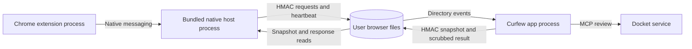

# Chrome native host

This document addresses the engineer building Curfew and its Chrome extension.
The engineer must use the protocol below and supply the production extension ID
before publishing the browser integration.

Curfew bundles `studio.hypertext.curfew.browser` in `Contents/Resources`.
The app installs a user native-host manifest under
`Library/Application Support/Google/Chrome/NativeMessagingHosts`. The manifest
allows one exact extension origin and names the helper with an absolute path.
Chrome supplies the caller origin as the helper's first argument. The helper
rejects a different origin before reading requests or writing local state.

## Identity and release

As of 2026-09-08, the unpacked development extension uses ID
`loammdknmfbkjnckaeeagnmakinknbck`. Its manifest must include the exact public key
in `BrowserNativeInstallation.developmentPublicKey`. SHA-256 of its decoded DER
key begins `be0cc3adc51a9d2a04406dc0a8dad12a`. No private key is checked in.

Release builds read `CURFEW_BROWSER_EXTENSION_ID` from Xcode build settings into
the app's `CurfewBrowserExtensionID` Info.plist entry. The value remains empty
until the Chrome Web Store draft supplies an ID. Curfew refuses to install a
manifest for an empty ID or anything except 32 lowercase `a` through `p` letters.
The release engineer must publish the draft and set that value. Curfew never
substitutes the development ID or a wildcard in a production manifest.

The helper resolves its flavor and pinned ID from its containing app bundle.
Chrome does not inherit the app's launch environment. This prevents a Debug
helper from reading production state through the generic CLI flavor default.

## Local protocol

Each message consists of a native-endian UInt32 byte count followed by one UTF-8
JSON object. The helper rejects inbound lengths above 64 MiB before reading the
body. Responses never exceed 1 MiB. Standard output contains only framed JSON.
Standard error contains fixed diagnostic text without request values.

All requests use `schemaVersion: "browser-host/1"`, `requestId`, and `type`.
The caller chooses a nonempty request ID of at most 128 UTF-8 bytes. Every
response echoes it. Requests reject unknown fields. For example:

```json
{"schemaVersion":"browser-host/1","requestId":"policy-1","type":"get_policy"}
```

`get_policy` and `heartbeat` accept only those three fields.
`review_destination` also requires `sessionId`, `destination`, and
`justification`. It permits `challengeAnswer`. The destination contains only
`origin` and `path`. For example, the origin can be `https://example.com` and
the path can be `/research`. The host rejects credentials, query strings,
fragments, noncanonical origins, and invalid path prefixes. Each private
answer has an 8192-byte limit.

Responses contain `schemaVersion`, `requestId`, `type`, and `generatedAt`.
They may contain `policy`, `result`, or `error`. Error tokens include
`invalid_request`, `policy_unavailable`, `review_timeout`, `host_unavailable`,
and `response_too_large`. A successful policy response with no `policy` means
Curfew has no latched work session. A `policy_unavailable` response means the
host cannot confirm that state. The extension must retain its cached policy
when it receives that error.

The policy object uses `browser-policy/1` and preserves `sessionID`, `task`,
`tracking`, base `scopes`, timed `grants`, `breakEndsAt`,
`connectionIsHealthy`, and `generatedAt`. A grant contains a scope and
`expiresAt`. Dates use UTC ISO 8601 strings. The extension must expire grants
and breaks using those timestamps even when Curfew has stopped. A result
contains `decision` and `reason`. A grant adds `scope`; a challenge adds
`question`. The host includes the latest policy with resolved reviews.

## Queue and lifetime

The following deployment diagram shows the processes and shared files.



The host and app exchange HMAC-SHA256 records in the flavor-specific Curfew
Application Support directory's `browser` folder. This follows the existing
signed MCP file-queue pattern. Curfew uses a separate browser queue and does
not use the unused socket interface. A file lock serializes queue mutations
from multiple Chrome host processes. Atomic replacement prevents partial
policy reads. Files have mode 0600 before replacement; the browser directory
has mode 0700. The local secret authenticates records against accidental or
unrelated writes. It does not defend against someone with the user's shell.

The host waits at most 55 seconds for a review. Curfew refuses requests older
than 60 seconds, requests with another session ID, and answers that arrive
after the request expires or its session changes. Curfew validates each scope
through `BrowserDestinationScope` and verifies that it covers the requested
destination. Curfew removes justification and challenge-answer fields in the
same atomic write that publishes the result. Curfew prunes resolved entries
after 120 seconds and drops stale pending entries. The queue holds at most
128 entries. Curfew logs only the hostname, decision, and scope kind for reviews.

After an app restart, Curfew preserves a signed active snapshot until Docket
confirms a replacement task or terminal task. An unavailable or idle first
poll cannot clear that snapshot. If Docket only returns idle after the task
completed while Curfew was stopped, the cached policy stays active until Docket
returns task context again. The snapshot lacks organization context for a
separate terminal-task lookup after restart.

An accepted heartbeat stores the caller's extension origin and two timestamps
in a signed record. Settings can report communication as healthy for 60 seconds.
The claim proves that the host accepted a message from the configured caller.
It does not prove that Chrome still has a tab open or that an extension cannot
be disabled.

Uninstall removes the browser files with Curfew's Application Support state.
Curfew removes the Chrome manifest only when it still names this app's helper.
An uninstall must preserve a manifest subsequently installed by another flavor.
Reinstalling the integration recreates the manifest and secret. Removing or
rolling back the helper must not cause the extension to discard a cached active
policy.

## Verification limits

Swift tests cover framing, signing, tampering, file modes, queue scrubbing,
policy expiry, caller origins, manifest ownership, stale results, and uninstall.
The release engineer must still verify the signed app and the published Chrome
extension together. This repository cannot prove a Chrome Web Store identity
before the draft exists.
