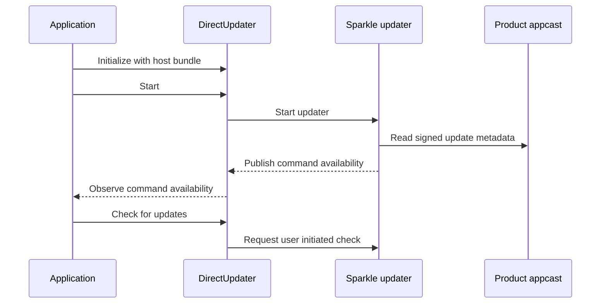

# Curfew distribution

Studio engineers must supply the product's signing and update credentials before
preparing a Curfew candidate. Reviewers must keep source integration separate
from a signed installation, an installed update and Apple acceptance.

The shared `Curfew` scheme archives the direct application. The Xcode project
pins `release-engineering` to an immutable Git revision. The app keeps the shared
`DirectDistribution.DirectUpdater` alive and starts it during application
initialization. The shared updater reads `SUFeedURL`, `SUPublicEDKey`, the
embedded version and the positive build number from the app bundle.

Curfew remains direct-only. The app forwards the shared updater's published
availability into its existing Check for Updates menu. Missing configuration
keeps development launch alive, disables the command and records the error.
Candidate preflight rejects missing or placeholder keys. The shared diagnostic
recovered the public half of the existing repository secret on 2026-10-05. The
app and declaration preserve that updater identity. Studio issued a Developer ID
Application identity for team T95VDD3A4W on 2026-10-05. Credentialed candidate
preparation and signed acceptance still remain separate gates.

Curfew's build phase signs its helper tools only in Debug to preserve development
Accessibility behavior. The shared release adapter signs the archive's nested
code centrally. The existing release scripts remain frozen at the hashes in
`Documentation/legacy-release/SHA256SUMS` until a real signed candidate passes
installation and update acceptance. The original tag workflow is archived as
`Documentation/legacy-release/release.yml.disabled` and cannot run automatically.

`CurfewUpdaterTests/missingConfigurationDisablesUpdates()` checks that a missing
configuration leaves the command disabled and records a failure. Shared SDK
tests cover bundle identity, configuration validation and update availability.

The following sequence diagram shows direct application update ownership.

The shared adapter owns Developer ID export, nested-code signing, notarization
and Sparkle signature verification. Curfew does not declare a Store channel. Its contract and verification limits are documented in
[the shared macOS guide](https://github.com/TheHypertextStudio/release-engineering/blob/main/docs/macos.md).

Local project parsing and SDK tests do not prove signed installation, update
acceptance or Store approval. Reverting the package dependency and updater wiring
restores the prior native integration. Engineers must
keep already published candidates and their matching appcast intact.

## Candidate and review boundary

The `studio.yaml` declaration retains release policy, formatting, strict lint,
all Curfew unit tests and the Debug build as named checks. The native
`LicenseEnvelopeContractTests` check verifies the provisioned public key rather
than treating source integration as license delivery. Source tests still reject
an all-zero licensing placeholder. The license key is currently real.

PR validation calls the pinned shared validator without release credentials.
The screenshot job still runs the existing Debug demo capture and saves its
images. Default-branch pushes create immutable direct candidates. The candidate
workflow also accepts `component-ready` so a declared dependency can
request reevaluation. Curfew currently declares no dependency candidates.

Promotion requires a manual dispatch with a candidate ID, manifest SHA-256 and
candidate-bound evidence. The required evidence covers signed installation,
installed upgrade, enforcement and recovery, license delivery, and screenshots.
`reconcile-one` resumes the same candidate. `withdraw` revokes its authorization.
No feature-branch push or diagnostic dispatch publishes Curfew.

The candidate's main app, widget and four bundled CLI tools target arm64 for the
first shared release. The existing helper build uses host-native Swift on the
Apple Silicon runner. The declaration does not advertise Intel support that
those helpers cannot provide. The widget retains its sandbox and app-group
entitlements. The main app retains the conservative direct-release entitlements.

The license Worker in `web/worker` and the static site in `landing` remain outside
this app-only candidate. Their committed sources contain no complete production
provider bindings. The existing Worker bootstrap only renders operator-selected
configuration and offers a dry run. This adoption does not redeploy the Worker,
change its secret, open checkout, or change the landing site's production host.
A reviewer must verify installed-app license delivery before promoting Curfew.

The launcher pins shared release v0.1.1 at revision
`52361b5370c319a8545ba72317fed86de06af565`. Its published archive SHA-256 is
`da4e10c048bfc8cfa1bb5135cab7c41946dae93a580e164cd5b6fff7e6eba9c2`.
The shared pin updater verified the downloaded bytes before updating the lock,
launcher, workflows and native package requirement.

The first shared candidate explicitly selects version 0.0.2. Curfew's current
native app and cask are 0.0.1, and this clone has no release tags. The override
preserves the documented 0.0.x line instead of interpreting the entire history
as a new minor release. Later candidate versions must still advance the released
version. The engine consumes this override once 0.0.2 reaches production. The next push
derives a new version from the commits since production.

The infrastructure root binds product credentials to `hypertext-curfew-release`
and immutable downloads to the shared `hypertext-studio-releases` bucket. Its
private state backend uses `hypertext-curfew-release-state`. The root reads the
workflow revision from the same product lock, so a pin update changes WIF's
workflow binding with the provider module pins. The weekly pin caller uses a separate workload identity and a repository-scoped
SSH deploy key stored in Secret Manager. That key and its binding are provisioned.
The caller creates a reviewable branch. A schedule declaration does not prove
that automation ran.

## Local verification

On 2026-10-05, native `CurfewTests` passed 830 tests with zero failures and
zero skips against the pinned SDK. The targeted license and updater acceptance
suite passed three tests. Release-policy, landing and license-Worker script
contracts passed 23 tests. These runs used unsigned Debug builds with two Xcode
jobs and disabled parallel testing. The pinned launcher also passed setup, every declared check and the unsigned
Release build. SwiftFormat, strict SwiftLint and actionlint passed. These checks
prove local integration and preserve the distinction from signed installation
and installed-upgrade evidence.

Local XCUITest capture remains open. macOS killed the unsigned UI runner before
it established a test connection. A signed run with the normal entitlements
failed because the local development App Groups profile is absent. A disposable
Studio-signed demo build with CLI-only empty entitlements built successfully,
but its UI runner exited with a signal kill before establishing a connection. The source and shipping entitlements were unchanged. PR CI renders headless fixtures instead of launching the UI runner. The native
snapshot suite exported six headless images, including Today, Schedule and the
lockout surface. These images do not count as UI capture or installed acceptance.
